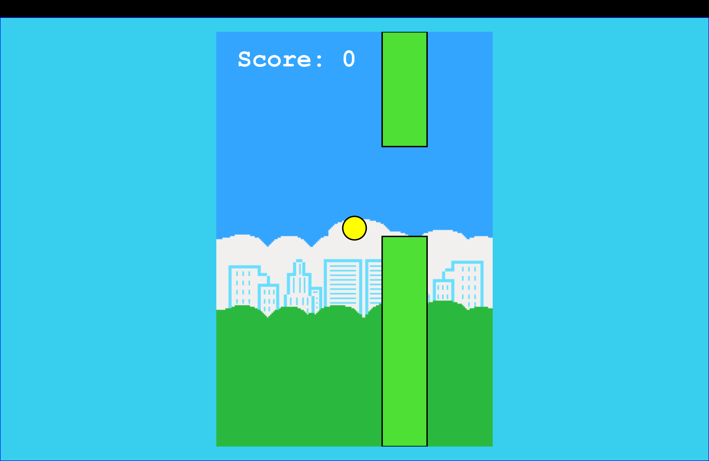
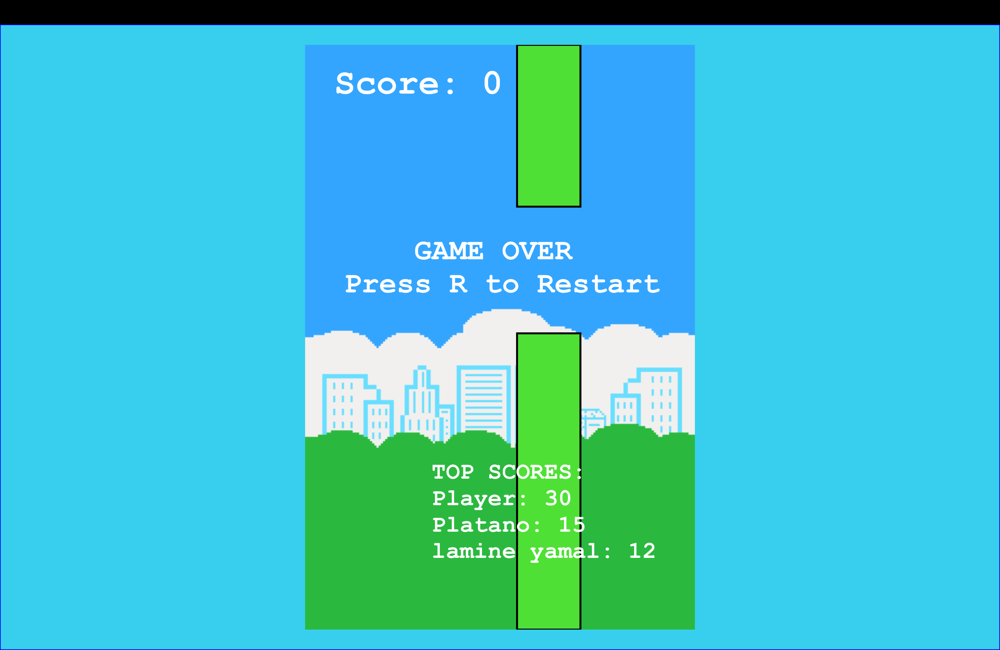
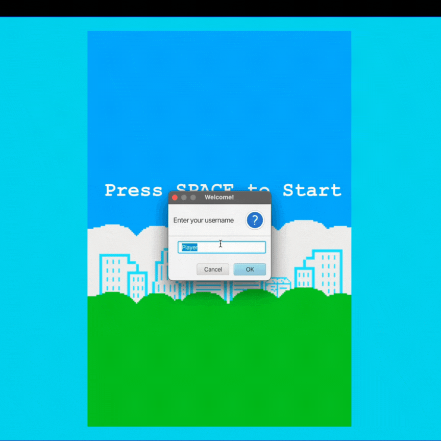
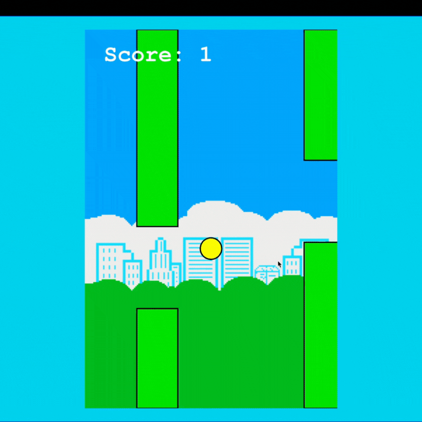

# FLAPPY BIRD (JAVA + JAVAFX)

A remake of the classic Flappy Bird game developed in Java using JavaFX.

# SCREENSHOTS

# GAMEPLAY DEMO
### GIF 1: Username Entry & Gameplay Start

### GIF 2: Score Tracking, Death Screen, & Restart

# GAME DESCRIPTION
This is a recreation of the 2013 hit game Flappy Bird. Once the game starts, the player is prompted to enter a username. Any runs under such username are tracked, and once the player dies:
- A **Game Over** message is displayed
- The **Top 3 leaderboard** appears
- The player is prompted: **Press R to Restart**
To play as a different user, the game must be restarted.

# HOW TO RUN
Requirements:
- Java: 24 (or any recent version ≥ 21)
- JavaFX: 21.0.6
- MySQL: running locally
- IDE (optional): IntelliJ IDEA CE or Ultimate editions
Running with IntelliJ
1. Clone the repo
2. Import as a Maven project
3. Set VM options (replace the paths with your local directories): \
  --module-path "/path/to/javafx-sdk-21.0.6/lib:/path/to/FlappyBird/target/classes" \
  --add-modules javafx.controls,javafx.fxml \
  --enable-native-access=javafx.graphics
4. Run the Main class

# FEATURES
- Procedurally randomized pipe placement
- Collision detection with pipes, floor, and ceiling
- Score tracking tied to player usernames
- Top 3 leaderboard display
- Restart ability without closing program

# TOOLS USED
- Java 24: Core game logic, physics, and application structure
- JavaFX 21.0.6: Rendering game loop, scene graph, animation, and UI
- MySQL: Persistent storage for usernames + high scores
- IntelliJ IDEA CE or Ultimate Edition: Development + debugging environment
- Maven: Project build and dependency management

# POSSIBLE FUTURE IMPROVEMENTS
- Improved GUI layout
- Enhanced visuals and animations
- Sound effects
- Settings menu
- Difficulty scaling
